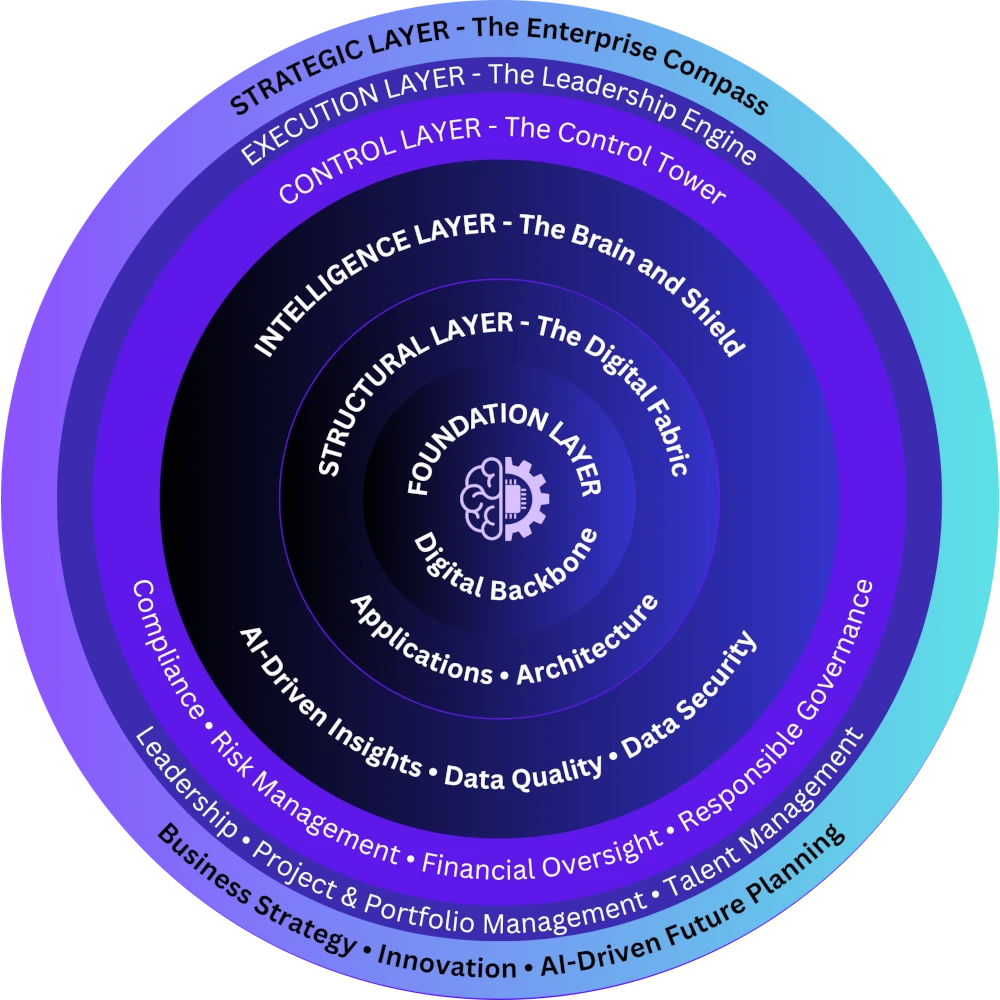
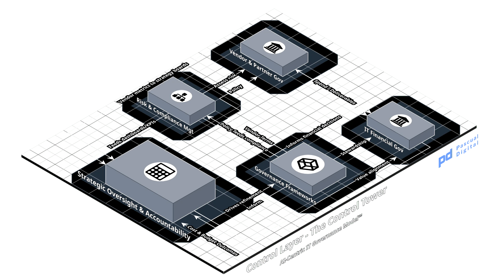
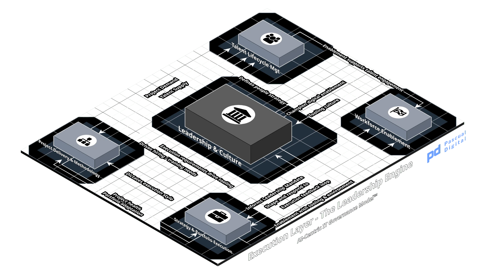
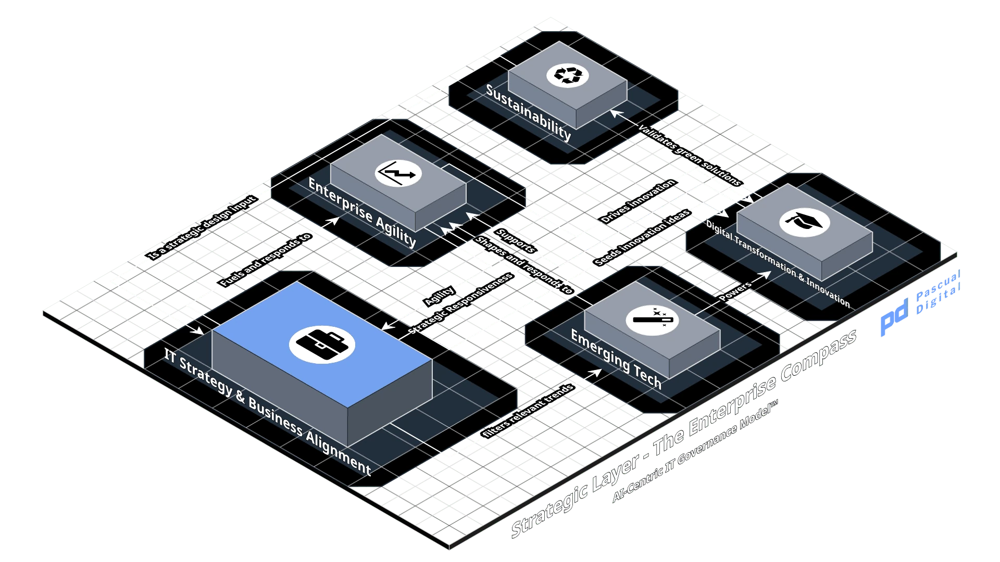

# The model

AI9GM numbers layers by dependency, not by importance. Weakness lower in the stack constrains every layer above it, and weakness higher in the stack leaves every layer below it without direction. Layer 6 is not the destination of the model and Layer 1 is not every organization's starting point ([AI9GM-v0_9.md](../AI9GM-v0_9.md) section 0.1).

## Layer 1. Foundation

Layer 1

[Foundation](./layers/l1-foundation.md)

The Digital Backbone

Can it run?

Provide and operate the compute, storage, network and service capacity that every layer above depends on, at a level of availability and performance that AI workloads can be planned against.

### Focus areas

- **Infrastructure and Cloud Strategy** (L1-FA-01). On-premise, cloud and hybrid placement, capacity architecture, accelerator provisioning.
- **Asset and Configuration Management** (L1-FA-02). Asset tracking, CMDB, lifecycle management. Models and datasets are configuration items.
- **Operations Management** (L1-FA-03). Monitoring, maintenance, automation, DevOps and SRE practice.
- **Availability and Capacity Management** (L1-FA-04). Uptime, performance, disaster recovery, capacity forecasting.
- **Incident and Problem Management** (L1-FA-05). Incident resolution and root cause elimination.
- **Service Desk and IT Support** (L1-FA-06). User support, ticketing, service levels, self-service.

Why it matters for AI

AI workloads make demands that ordinary application infrastructure was not sized for. A weak Foundation layer does not degrade the layers above it gracefully. It caps them.

## Layer 2. Structural

Layer 2

[Structural](./layers/l2-structural.md)

The Digital Fabric

Can it connect?

Connect enterprise systems under declared contracts so process and data move between them, and maintain the architecture standards that determine what gets built and with what.

### Focus areas

- **Enterprise Applications** (L2-FA-01). ERP, CRM, SCM, HRMS and other business-critical systems.
- **Custom Software Development** (L2-FA-02). Internal and external engineering. Where AI assists development, delivery governance is held by STRATA Protocol: project classification at Stratum 1, the copilot authority chain at Stratum 3 and the artifact trail at Stratum 5. AI9GM does not restate these.
- **Application Lifecycle Management** (L2-FA-03). Development, testing, deployment, maintenance.
- **Integration and Middleware** (L2-FA-04). API management, service orchestration, microservices, event transport.
- **User Experience, Accessibility and Machine Consumability** (L2-FA-05). Human interface design, plus the completeness properties an interface requires when its consumer cannot ask questions: accurate and complete specification, schemas carrying real examples and honest descriptions, documented error conditions, discoverable authentication and explicit relationships between operations.
- **Enterprise Architecture Frameworks** (L2-FA-06). TOGAF, Zachman.
- **Service Management and ITSM Alignment** (L2-FA-07). ITIL and COBIT alignment of services to business need.
- **IT Product Management** (L2-FA-08). IT systems managed as products with roadmaps.
- **Standards and Best Practices** (L2-FA-09). Interoperability and technical standards adherence.
- **Technology Roadmaps and Rationalization** (L2-FA-10). Redundancy elimination, portfolio alignment.

Why it matters for AI

Fragmented systems produce fragmented intelligence.

Layer 2 moves data and publishes the contracts that describe it. It does not decide whether the data is fit for a given use, which belongs to Layer 3.

The interface contract carries more weight than it used to. Where the consumer of an interface is an autonomous system rather than a developer, specification completeness stops being a quality attribute and becomes a functional requirement. That consumer has no context beyond the surface and no route to ask for the rest. Knowledge that previously sat with the team running a system has to exist in the machine-readable contract, because nobody is left in the path to supply it.

## Layer 3. Intelligence

Layer 3

[Intelligence](./layers/l3-intelligence.md)

The Brain & Shield

Can it be trusted?

Build and operate the model, data and security controls that make AI outputs usable, and produce the evidence that those controls ran.

### Focus areas

- **AI/ML Strategy and Automation** (L3-FA-01). Model development, MLOps, deployment pipelines, drift detection, bias and fairness testing.
- **Data Architecture and Management** (L3-FA-02). Lakes, warehouses, structured and unstructured data design.
- **Data Quality and Master Data Management** (L3-FA-03). Accuracy, consistency, lineage, mastering. Fitness determination covers data reaching a model through an interface, not only data held in a store.
- **Data Governance Operations** (L3-FA-04). Classification, retention execution, consent enforcement, ethical AI controls in operation.
- **Business Intelligence and Analytics** (L3-FA-05). Dashboards, reporting, predictive analytics.
- **Cybersecurity Strategy and Threat Management** (L3-FA-06). Cyber defense, threat intelligence, SOC operations.
- **Privacy & Security Engineering** (L3-FA-07). Technical implementation of ISO 27001, NIST, GDPR, HIPAA and PCI-DSS requirements: minimization, pseudonymization, encryption at rest and in transit, consent enforcement, logging.
- **Identity and Access Management** (L3-FA-08). SSO, MFA, role-based access control, privileged access.
- **Security Operations and Incident Response** (L3-FA-09). SIEM, forensic analysis, response execution.
- **Vulnerability Management** (L3-FA-10). Continuous assessment, penetration testing, remediation tracking.

Why it matters for AI

A model is only as good as the data it learns from and only as safe as the controls around it. Layer 3 produces the evidence that Layer 4 verifies.

## Layer 4. Control

Layer 4

[Control](./layers/l4-control.md)

The Control Tower

Who is accountable?

Set policy, allocate accountability, decide risk and verify that required controls operated.

### Focus areas

- **IT and AI Governance Frameworks** (L4-FA-01). COBIT, ITIL, ISO/IEC 38500, ISO/IEC 42001 adoption decisions.
- **Policy Development and Enforcement** (L4-FA-02). AI policy, standard operating procedures, the mandatory control catalog.
- **Auditing and Reporting** (L4-FA-03). Internal and external audit, evidence review, attestation, board and executive reporting, IT ethics.
- **Risk Management** (L4-FA-04). Enterprise and AI risk assessment, risk appetite, mitigation planning, residual risk acceptance, AI system classification.
- **Compliance Management** (L4-FA-05). Regulatory interpretation and adherence determination across SOX, GDPR, HIPAA, PCI-DSS, ISO/IEC 42001 and the EU AI Act. DPIA sign-off and regulator liaison.
- **IT Budgeting and Cost Optimization** (L4-FA-06). CapEx and OpEx, chargeback and showback.
- **Cloud and SaaS Cost Management** (L4-FA-07). Usage optimization, cloud cost governance, model training and inference cost accountability.
- **Technology Investment Planning** (L4-FA-08). ROI analysis, emerging technology investment appraisal.
- **Procurement and Contract Management** (L4-FA-09). Vendor negotiation, service levels, licensing, model licensing and training-data provenance terms.
- **Vendor Risk Management** (L4-FA-10). Vendor security, compliance and performance assessment.
- **Strategic Oversight and Accountability** (L4-FA-11). Named ownership per AI system, decision gates, escalation paths, ethics review, metrics tied to business goals.

Why it matters for AI

Without Layer 4, AI produces uncontrolled cost, legal exposure and unaccountable decisions. Every control Layer 3 runs exists because Layer 4 required it.

## Layer 5. Execution

Layer 5

[Execution](./layers/l5-execution.md)

The Leadership Engine

Can it be built?

Convert authorized intent into delivered capability through sequencing, delivery discipline and the people who do the work.

### Focus areas

- **IT Portfolio Management** (L5-FA-01). Alignment of initiatives to business goals, prioritization.
- **PMO and Delivery Governance** (L5-FA-02). Execution policy, delivery risk mitigation.
- **Change Management and Digital Adoption** (L5-FA-03). 
- **Delivery Methodologies** (L5-FA-04). Agile, waterfall and hybrid selection. Where AI assists development, delivery governance is held by STRATA Protocol and its phase-gated execution loop at Stratum 4. STRATA is not a fourth option alongside agile, waterfall and hybrid. It sits above the methodology choice and governs how a copilot operates inside whichever one is selected. An organization running agile with AI assistance runs both.
- **Resource and Capacity Planning** (L5-FA-05). Staffing, skills allocation.
- **KPIs and Performance Metrics** (L5-FA-06). OKRs, critical success factors, delivery measures.
- **IT Leadership and Culture** (L5-FA-07). CIO, CTO, CAIO and CISO leadership, executive alignment, innovation tone.
- **Talent Acquisition and Development** (L5-FA-08). Hiring, training, succession, retention, AI literacy.
- **Workforce Collaboration and Productivity** (L5-FA-09). Tooling, hybrid work enablement, human and AI task allocation.

Why it matters for AI

Execution determines whether AI becomes delivered capability or sunk cost.

## Layer 6. Strategic

Layer 6

[Strategic](./layers/l6-strategic.md)

The Enterprise Compass

Should it be built?

Decide which AI capabilities the organization should hold, why, and what governance capability it must build to hold them responsibly.

### Focus areas

- **IT Strategy and Business Alignment** (L6-FA-01). 
- **Emerging Technologies and Trends** (L6-FA-02). AI, quantum computing, blockchain, edge computing evaluation.
- **Digital Change and Innovation Labs** (L6-FA-03). Prototyping, research, new business model testing.
- **Enterprise Agility and Competitive Advantage** (L6-FA-04). 
- **Sustainability and Green IT** (L6-FA-05). Energy and carbon accountability for training and inference.

Why it matters for AI

Layer 6 decides what should be built. Without it, the five layers below execute efficiently in no particular direction.

At maturity Level 2, a small organization maintains roughly a dozen documents, not seventy-one artifact types. See the [minimum viable set](minimum-viable-set.md).
