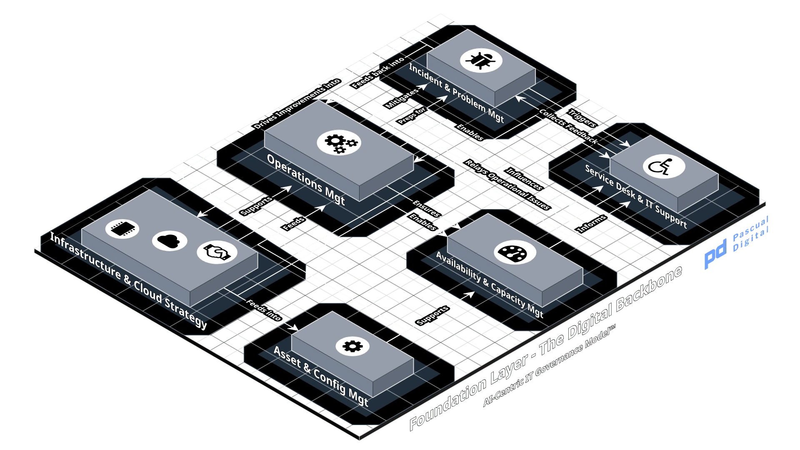

# Layer 1. Foundation

Layer 1

The Digital Backbone

Can it run?

## Purpose

Provide and operate the compute, storage, network and service capacity that every layer above depends on, at a level of availability and performance that AI workloads can be planned against.

## Scope boundary

| Excluded | Owned by | Boundary |
| --- | --- | --- |
| Data quality, lineage and fitness for use | L3 | L1 provides the storage. L3 determines whether the contents are usable. |
| Data pipelines and integration transport | L2 | L1 runs the hosts. L2 designs what moves between them. |
| Identity and access management operation | L3 | L1 provides the directory infrastructure. L3 operates identity and enforces access. |
| Model training pipelines and MLOps | L3 | L1 provides accelerators. L3 decides how they are used for training. |
| Security policy and the mandatory control catalog | L4 | L1 implements controls that L4 requires. |
| Cloud cost envelope and chargeback model | L4 | L1 optimizes within the envelope. L4 sets it. |
| Capacity investment approval above threshold | L4 | L1 forecasts and requests. L4 authorizes. |
| Technology selection and platform standards | L2 | L1 operates what the Architecture Review Board admits. |

Layer 1 provides capacity and runs it. It does not decide what the capacity is spent on, what is stored in it or who is allowed to reach it.

**The boundary most often crossed in practice.** Infrastructure teams are frequently asked to decide accelerator allocation between competing AI initiatives. That is a portfolio decision at Layer 5 executed by Layer 1, not a Layer 1 decision. Where Layer 1 makes it by default, the symptom is that whoever asked first gets the capacity.

## Inputs

| Item | From | Form |
| --- | --- | --- |
| Workload capacity requirements | 3 | Training and inference profiles per model, with growth assumptions |
| Integration and data movement volumes | 2 | Throughput and latency requirements per interface |
| Availability requirements per AI service | 4 | Consequence classification driving the service level objective |
| Mandatory infrastructure controls | 4 | Control catalog entries applicable to hosting and operations |
| Approved cost envelope | 4 | Annual and per-initiative spending authority |
| Initiative pipeline and sequencing | 5 | Portfolio schedule with capacity implications |
| Vendor roadmaps and hardware availability | external | Accelerator lead times, cloud region and instance availability |
| Regulatory hosting constraints | 4 | Data residency and sovereignty determinations |

## Outputs

| Item | To | Form |
| --- | --- | --- |
| Available and performant compute, storage and network | 2 | Provisioned environments against a published capacity model |
| Available and performant compute, storage and network | 3 | Provisioned environments against a published capacity model |
| Service level performance against objectives | 4 | Availability and performance reporting per AI service |
| Operational telemetry and logs | 3 | Retained logs meeting evidence requirements set at L4 |
| Operational telemetry and logs | 4 | Retained logs meeting evidence requirements set at L4 |
| Consumption and cost actuals | 4 | Attributable cost per model, per initiative and per business unit |
| Capacity constraints and lead times | 5 | Forecast that bounds what the portfolio can schedule |
| Capacity constraints and lead times | 6 | Forecast that bounds what the portfolio can schedule |
| Configuration state of the estate | 3 | CMDB, including models and datasets as configuration items |
| Configuration state of the estate | 4 | CMDB, including models and datasets as configuration items |
| Recovery capability evidence | 4 | Tested recovery point and recovery time results |
| Data access source reconciliation for AI workloads | 2 | Observed connection sources and destinations for AI workloads, reconciled against the Layer 2 interface catalog |

**Output 8 exists because no other layer can produce it.** Layer 2 knows what it published and cannot see what a model reads outside that catalog. Layer 3 would have to instrument for it. Layer 1 already holds connection-level visibility, so the reconciliation costs little here and is the only place it is cheap. Without it, the Layer 2 shadow data access metric is unmeasurable.

**Output 5 is the one that gets omitted.** Capacity constraints are an input to strategy, not just a consequence of it. A Layer 1 that does not publish its lead times produces a Layer 6 that plans against imaginary capacity.

## Decision rights

| ID | Decision | Decides | Consulted | Executes | Evidence | Delegated band | Interpretation |
| --- | --- | --- | --- | --- | --- | --- | --- |
| L1-01 | Hosting placement for an AI workload (on-premise, cloud, hybrid) | Architecture Review Board | Platform Owner, CISO and CFO | Platform Owner | Placement record with cost, latency and data-residency rationale |  | Decide where a workload physically runs, weighing cost, latency and where the data is legally permitted to sit. Residency usually decides this before performance does. |
| L1-02 | Capacity expansion as an operating resource, above the delegated band | CFO | Platform Owner and CAIO | Platform Owner | Capacity business case, approved envelope | Delegated | Approve more capacity to serve demand that already exists. The question is whether the growth is real and sustained, not whether the capability is worth having. |
| L1-03 | Capacity expansion as an investment, where new capability rather than existing growth is being funded | Portfolio Board | CFO, Platform Owner and CAIO | Platform Owner | Investment decision record with the capability it enables | Delegated | Approve capacity for something not yet in production. This is an investment decision wearing an infrastructure request, and it routes to the Portfolio Board for that reason. |
| L1-04 | Capacity allocation between competing AI initiatives | Portfolio Board | Platform Owner and CAIO | Platform Owner | Allocation record naming the deferred initiative and the date by which the deferral is reconsidered |  | Decide which initiative gets scarce capacity and which waits. The deferred initiative is named in the record, because an unnamed deferral is a portfolio decision made inside a ticket queue. |
| L1-05 | Service level objective for an AI service | Service Owner | Business Owner and Platform Owner | Head of Operations | Published SLO in the service catalog, with consequence class |  | Set the availability and performance the service is held to. The objective follows from what happens when the service is unavailable, not from what the platform can comfortably deliver. |
| L1-06 | Production change to the AI platform | Change Advisory Board | Platform Owner and Model Owner | Platform Owner | Change record with rollback plan and test evidence |  | Authorize a change to the platform AI systems run on, with a tested rollback. Standard change control, applied to a substrate whose failures are less visible than application failures. |
| L1-07 | Emergency change without prior CAB approval | Head of Operations | Platform Owner | Platform Owner | Emergency change record, retrospective CAB review within five working days |  | Proceed with an urgent change ahead of approval. The control is not the approval, it is the retrospective review inside a stated window. |
| L1-08 | Major incident declaration for a production AI service | Head of Operations | Service Owner and CISO | Head of Operations | Incident record, timeline, post-incident review |  | Decide that a degradation is severe enough to invoke major incident handling. Under-declaring is the common error, because AI service degradation is often gradual rather than binary. |
| L1-09 | Infrastructure decommission supporting a production model | Platform Owner | Model Owner and Business Owner | Platform Owner | Decommission record, artifact and data disposition |  | Retire infrastructure a production model depends on, having established what happens to the model artifacts and data on it. |
| L1-10 | Recovery invocation during a disaster event | Head of Operations | Platform Owner and Business Owner | Platform Owner | Invocation record, achieved recovery point and time |  | Decide to fail over or restore. For AI systems this includes model weights and feature stores, not only databases, and a plan that omits them restores everything the model needs except the model. |

Two allocations here carry the weight of the layer.

**Capacity is split by what the spend is for, not by its size.** The CFO owns capacity as an operating resource, which covers growth in existing demand. The Portfolio Board owns capacity as an investment, which covers new capability. The same dollar amount routes differently depending on which it is, and misrouting produces either slow operations or unexamined investment.

**A deferral with no date is a stop decision nobody made.** Naming the deferred initiative makes the tradeoff visible; naming the reconsideration date is what stops indefinite deferral from becoming cancellation by attrition. The same requirement applies at L5-02 sequencing.

**Capacity allocation sits at the Portfolio Board, not at Layer 1.** Infrastructure executes the allocation and names the initiative that did not get capacity. That naming is the evidence, and it is what converts a silent operational tradeoff into a governed decision.

**Emergency change authority is real and bounded.** Removing it produces unlogged changes. The control is not the approval, it is the retrospective review within a stated window.

## Artifacts

| ID | Name | Owner | Review | Scope | Required from |
| --- | --- | --- | --- | --- | --- |
| L1-ART-01 | Configuration management database, including models, datasets and feature stores as configuration items | Platform Owner | Continuous, audited quarterly | organization | Level 2 |
| L1-ART-02 | Incident register with root cause linkage | Head of Operations | Continuous | organization | Level 2 |
| L1-ART-03 | Change log for the AI platform | Platform Owner | Continuous | organization | Level 2 |
| L1-ART-04 | Capacity model and forward forecast covering accelerator, storage and network | Platform Owner | Quarterly | organization | Level 3 |
| L1-ART-05 | Disaster recovery plan covering model artifacts, feature stores and training data, not only databases | Platform Owner | Tested annually, plan reviewed semi-annually | organization | Level 3 |
| L1-ART-06 | Hosting placement register with residency determinations | Platform Owner | On change | organization | Level 3 |
| L1-ART-07 | Cost attribution report per model and per initiative | Platform Owner | Monthly | organization | Level 4 |
| L1-ART-08 | Data access source reconciliation for AI workloads | Platform Owner | Monthly, published to L2 | organization | Level 4 |
| L1-ART-09 | Service catalog with service level objectives per AI service | Service Owner | On change, reviewed annually | system | per production AI service |
| L1-ART-10 | Runbooks for AI service operations | Service Owner | On change | system | per production AI service |

**Scoping.** Organization-level artifacts are required from the stated maturity level. System-level artifacts are required per AI system, model, interface or event according to the condition stated. Artifacts in bold are part of the Level 2 minimum. See the minimum viable set document for what this amounts to at small scale.

**Two of these are usually missing.** Model artifacts and feature stores are rarely present in the CMDB, which means no one can produce a list of what runs in production. Disaster recovery plans routinely cover the database and omit the model weights, so recovery restores the data a model needs without the model itself.

## Metrics

| Name | Unit | Guidance |
| --- | --- | --- |
| Availability of production AI services against published SLO | Percentage | Measured per service, never aggregated. Measures whether the objective set from consequence is being met. |
| Capacity headroom against forecast | Months of runway at current growth | Below three months is an escalation trigger to Layer 5 |
| Recovery time achieved in the most recent DR test, against objective | Minutes | An untested plan scores as failed |
| Configuration item coverage for production models | Percentage of production models present in the CMDB | Below 100 percent is a Layer 4 finding |
| AI workload data access sources reconciled to the Layer 2 interface catalog | Percentage | Unreconciled sources are shadow data access. Supports the Layer 2 metric of the same subject. |

Five metrics, applying the rule settled after Layers 2 and 3 were drafted: **a layer metric measures whether governance is working, not whether the technology is working.**

Three candidates were cut as operational rather than governance measures: accelerator utilization, mean time to restore and change failure rate. All three belong in operational reporting and none of them tells Layer 4 whether this layer is governed.

## Crosswalk

| Instrument | Coverage | Reference |
| --- | --- | --- |
| ITIL 4 | full | Service level management, availability, capacity and performance, incident, problem, change enablement, service desk, monitoring and event management |
| COBIT 2019 | full | DSS01 Managed Operations, DSS02 Service Requests and Incidents, DSS03 Problems, DSS04 Continuity, BAI09 Assets, BAI10 Configuration |
| ISO/IEC 27001:2022 | partial | A.5.29 and A.5.30 ICT readiness for continuity, A.7 physical controls, A.8.9 configuration management, A.8.13 backup, A.8.16 monitoring. Does not address AI capacity planning. |
| TOGAF 10 | partial | Technology Architecture domain only. Provides the method, not the operating practice. |
| ISO/IEC 42001 | partial | Clause 8 operational planning and control touches resourcing. Does not specify infrastructure practice. |
| NIST AI RMF | partial | MANAGE 2 and 4 assume operational capability without specifying it. |
| EU AI Act | partial | Article 12 record-keeping and logging obligations fall to this layer for execution. Article 15 requirements for accuracy and cybersecurity depend on Layer 1 capability but are determined at Layer 4. Article 17 quality management system touches operations. |
| ISO/IEC 38500 | none | Principle-level only. |
| Greenhouse Gas Protocol, CSRD | partial | Measurement of energy consumed by AI workloads, executed here |

**The gap this crosswalk exposes.** No instrument in the list specifies capacity planning for accelerated compute, nor treats model artifacts as recoverable assets. Both are Layer 1 practice that AI9GM has to define rather than cite. That is a genuine contribution and it should be stated as one rather than papered over with a partial-coverage mark.

## Maturity descriptors

| Level | Name | Descriptor |
| --- | --- | --- |
| 1 | Initial | AI workloads run wherever capacity was available when the project started. No capacity model. Models and datasets absent from the CMDB. Recovery for AI systems untested and probably undefined. Infrastructure learns about a new production model when it saturates something. |
| 2 | Managed | Capacity is tracked and forecast for known workloads. AI services appear in the service catalog, though objectives are inherited from general IT rather than set from consequence. Some models are configuration items. Recovery plans exist and cover data but not model artifacts. Placement decisions are made and recorded, inconsistently. |
| 3 | Defined | Published capacity model covering accelerator, storage and network, with stated lead times. All production models and datasets are configuration items. Service level objectives are set per AI service from its consequence classification. Recovery plans include model artifacts and feature stores, tested annually. Placement, expansion and allocation decisions follow the register in section 5 with retained evidence. |
| 4 | Quantitatively Managed | Capacity headroom, availability and restore time are measured per service and reported to Layer 4 on a fixed cycle. Deviation from objective triggers a defined response before it becomes an incident. Cost is attributed per model. Recovery objectives are validated by test, not asserted. Capacity constraints are published to Layer 5 in a form the portfolio schedule consumes. |
| 5 | Optimizing | Capacity is provisioned from forecast rather than from request. Configuration state is generated by the platform rather than maintained by hand, so CMDB coverage is a property of deployment rather than a compliance exercise. Recovery is exercised continuously rather than annually. Cost and carbon per inference are measured and fed to Layer 6 as inputs to strategy. |

The distance between levels 2 and 3 is the largest in this layer and the one most organizations underestimate. It requires treating model artifacts as first-class configuration items, which usually means changing the deployment pipeline rather than changing the CMDB.

## Anti-patterns

### The invisible model

A production model runs on infrastructure that has no record of it. Nobody can produce a complete list of what is in production, so nobody can assess exposure, plan capacity or recover after failure.

Detection: Detected by asking for the list and receiving a spreadsheet maintained by one person.

### Recovery without the model

The disaster recovery plan covers databases, application servers and network. It does not cover model weights, feature stores or the training data needed to rebuild them. Recovery restores everything the model needs except the model.

Detection: Detected by reading the plan rather than by testing it.

### First-come capacity

Accelerator capacity is allocated to whoever requested it first, or loudest. No record exists of which initiative was deferred. Portfolio decisions are being made inside an infrastructure ticket queue, without the Portfolio Board's knowledge.

Detection: Detected by asking which initiative did not get capacity last quarter and receiving no answer.

### Inherited service levels

An AI service that influences a lending decision runs against the same availability objective as the internal wiki, because both inherited the default. Consequence never entered the objective.

Detection: Detected by comparing the service catalog against the AI system classification register at Layer 4.

### Cost without attribution

Total cloud spend is known. Spend per model is not. Layer 4 cannot govern an envelope it cannot break down, so cost optimization becomes an across-the-board cut that hits the cheapest workloads hardest.

Detection: Detected by asking for spend per model and receiving only a total.
