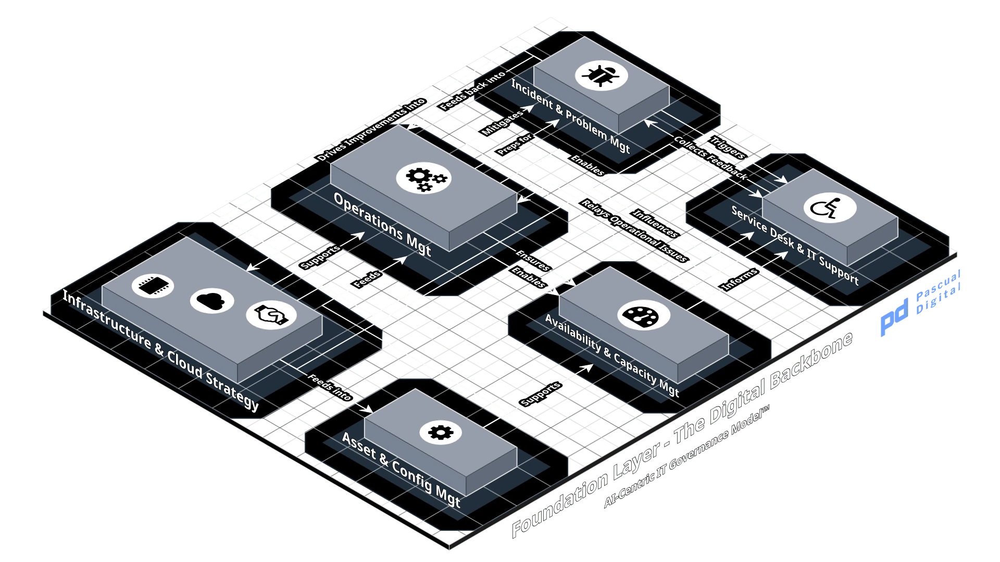

# Layer 2. Structural

Layer 2

The Digital Fabric

Can it connect?

## Purpose

Connect enterprise systems under declared contracts so process and data move between them, and maintain the architecture standards that determine what gets built and with what.

## Scope boundary

| Excluded | Owned by | Boundary |
| --- | --- | --- |
| Data quality, lineage and fitness for use | L3 | L2 publishes the contract. L3 declares whether a consumer may rely on it. |
| Model development, training and MLOps | L3 | L2 provides the surfaces a model reaches through. |
| Identity and access management operation | L3 | L2 specifies how authentication is discovered. L3 operates it. |
| Access policy and classification requirements | L4 | L2 implements what L4 requires. |
| Infrastructure hosting, capacity and runtime | L1 | L2 decides what is built. L1 decides where it runs and keeps it running. |
| Vendor contract, license and provenance terms | L4 | The Architecture Review Board admits a third-party model technically. L4 signs for it. |
| Portfolio prioritization and sequencing | L5 | L2 states what is architecturally coherent. L5 decides what gets done and when. |
| Investment appraisal against business strategy | L6 | L2 supplies the rationalization case. L6 decides whether it is worth pursuing. |
| Risk acceptance | L4 | See the boundary note below. This is the one most often crossed. |

Layer 2 defines and publishes contracts. It does not judge whether what flows through them is good enough to act on.

**The boundary most often crossed in practice.** An Architecture Review Board or Head of Enterprise Architecture grants an exception to a standard, and the exception is materially a risk acceptance. A system ships without the encryption pattern, without the audit hook or against a deprecated interface, and the record of that decision lives in an architecture exception register rather than in a risk register. Layer 4 never sees it.

Architecture exceptions are legitimate and necessary. The failure is silent reclassification of a risk decision as a technical one. Section 5 sets an escalation threshold to address it.

## Inputs

| Item | From | Form |
| --- | --- | --- |
| Business capability requirements | 6 | Capability definitions with intended outcomes |
| Initiative pipeline and sequencing | 5 | Portfolio schedule with architectural dependencies |
| Mandatory control catalog and policy | 4 | Control requirements applicable to applications and interfaces |
| Approved vendors, models and license terms | 4 | Contracted terms including provenance and audit rights |
| Data domain definitions and master record rules | 3 | Semantics that interface contracts must express accurately |
| Model interface requirements | 3 | What a production model needs to reach, at what volume and latency |
| Platform capability and constraint | 1 | What the infrastructure can support and by when |
| Data access source reconciliation for AI workloads | 1 | Observed connection sources, reconciled against this layer's interface catalog |
| Vendor product roadmaps and standards releases | external | Deprecation notices, specification versions |

## Outputs

| Item | To | Form |
| --- | --- | --- |
| Interface contracts and specifications | 3 | Versioned machine-readable specifications with descriptions, examples and documented errors |
| Interface contracts and specifications | 1 | Versioned machine-readable specifications with descriptions, examples and documented errors |
| Interface contracts and specifications | external | Versioned machine-readable specifications with descriptions, examples and documented errors |
| Architecture standards register | 1 | Approved patterns, technology selections and their review dates |
| Architecture standards register | 3 | Approved patterns, technology selections and their review dates |
| Architecture standards register | 5 | Approved patterns, technology selections and their review dates |
| Interface catalog for AI-consumed surfaces | 3 | The list Layer 3 assesses for fitness |
| Application portfolio inventory | 4 | Systems with business criticality, ownership and lifecycle state |
| Application portfolio inventory | 5 | Systems with business criticality, ownership and lifecycle state |
| Technology roadmap and rationalization plan | 5 | Sequenced change with redundancy removal named |
| Technology roadmap and rationalization plan | 6 | Sequenced change with redundancy removal named |
| Architecture exception register | 4 | Open exceptions with expiry and the risk each carries |
| Non-functional requirement baselines | 1 | Availability, latency and throughput requirements per service |
| STRATA artifact trail | 5 | Classification record, authority chain, phase sign-offs and deviation log, per codebase where AI assists development |

**Output 6 is the one currently absent in most organizations.** The exception register exists as an architecture artifact and stops there. Sending it to Layer 4 on a fixed cycle is what converts an accumulating technical compromise into a governed risk position.

## Decision rights

| ID | Decision | Decides | Consulted | Executes | Evidence | Delegated band | Interpretation |
| --- | --- | --- | --- | --- | --- | --- | --- |
| L2-01 | Approve an integration pattern for AI system data access | Architecture Review Board | Head of Enterprise Architecture, CISO and Platform Owner | Engineering | Approved pattern in the standards register with review date |  | Decide how AI systems are permitted to reach data. Approving the pattern once prevents each team inventing its own and prevents direct store access becoming the default. |
| L2-02 | Admit a third-party model or AI API into the estate | Architecture Review Board | Vendor Lead, CISO, DPO and Model Owner | Engineering | Technical admission record referencing the vendor assessment |  | Decide that an external model may be used at all, on technical grounds. Admission is not procurement and not authorization to deploy; both happen at Layer 4. |
| L2-03 | Approve a technology selection or platform standard | Architecture Review Board | Head of Enterprise Architecture and CTO | Engineering | Standards register entry with review date |  | Decide what the organization builds with. Every selection is a commitment with an exit cost, which is why the register carries review dates. |
| L2-04 | Set the interface contract standard for the estate | Head of Enterprise Architecture | CTO, CISO and Data Steward | Engineering | Published contract standard covering schema descriptions, examples, error conditions, authentication discovery and action surface classification |  | Define what a complete interface specification contains, including whether an interface is classified as read-only or action-bearing for autonomous consumers. |
| L2-05 | Declare an interface fit for consumption by an autonomous or AI system | Data Steward | Head of Enterprise Architecture, Model Owner and CISO | Engineering | Interface fitness record covering schema completeness, documented error conditions, review date and the interface specification version it was declared against |  | Judge whether an interface is described accurately and completely enough that a consumer unable to ask questions can act on it correctly. This replaces the informal consultation a developer used to perform by asking someone. |
| L2-06 | Grant an exception to an architecture standard, within the delegated band | Head of Enterprise Architecture | Architecture Review Board | Engineering | Time-bounded exception record with expiry and named remediation owner | Delegated | Permit a departure from standard that does not weaken a mandatory control, time-bounded with a named remediation owner. |
| L2-07 | Grant an exception to an architecture standard, at or above the delegated band | Head of Risk | Head of Enterprise Architecture and CISO | Engineering | Risk acceptance record in the risk register, not the exception register | Delegated | Where the departure weakens a control the catalog marks required, the decision stops being architectural and becomes a risk acceptance. It leaves the layer for that reason. |
| L2-08 | Approve a breaking change to a published interface | Product or Service Owner | Head of Enterprise Architecture, consuming teams and Data Steward | Engineering | Deprecation notice, migration window, consumer notification record. Autonomous consumers are notified by fitness invalidation rather than by message. |  | Decide to change a contract consumers depend on. Where a consumer is autonomous, it will not complain; it will fail or produce wrong output quietly. |
| L2-09 | Authorize AI-assisted development on a codebase | CTO | Head of Enterprise Architecture and CISO | Engineering | STRATA Stratum 1 classification record and the Stratum 3 authority chain, versioned with the codebase |  | Decide that a copilot may operate on this code, under the STRATA authority chain. The classification and authority chain are versioned with the codebase. |
| L2-10 | Retire or replace an application in the portfolio | Head of Enterprise Architecture | Business Owner and PMO Lead | Engineering | Rationalization decision, migration plan, data disposition |  | Decide a system leaves the estate, with a migration path and a disposition for its data. |

Three allocations carry the weight of this layer.

**Third-party admission fires on an act nobody observes.** A commercial model enters through a product feature toggle or a team subscription, and no engineering decision point is crossed. Detection is by reconciling outbound network destinations and expense records against the admission register, which is the same reconciliation the undeclared third party anti-pattern relies on. Where that reconciliation does not run, detection is unresolved.

**The delegated band is the mechanism, not the policy.** Splitting exception authority at a published threshold is what stops architecture from becoming an unlogged risk-acceptance channel. Per section 0.1 of the normative reference, Layer 4 publishes the threshold. Until it does, this decision right is inert and exceptions default to the higher authority.

**Interface fitness sits with the Data Steward, not with architecture.** Architecture owns whether a contract is well-formed. Whether a decision may rest on it is a data judgment, following the pattern already applied to data domains. The row appears in both this specification and Layer 3 because the artifact is authored here and assessed there.

**Fitness records are version-bound.** A fitness record states the interface specification version it was declared against. A change to the schema, the enumerated values, the error set or the authentication method invalidates it, and AI consumption of an interface whose live version does not match its fitness record is a finding.

The trigger list is deliberately narrower than *breaking change*. Adding an optional field is not breaking and does not invalidate fitness. Adding an undocumented enumerated value is not breaking for a human consumer and **does** invalidate fitness, because that is precisely the condition the declaration exists to prevent. The test is what an autonomous consumer can misread, not what breaks a build.

**Breaking-change authority sits with the Product or Service Owner rather than the engineering team.** Where an autonomous system is a consumer, a breaking change has no support ticket path. The consumer does not complain. It fails or it produces wrong output.

## Artifacts

| ID | Name | Owner | Review | Scope | Required from |
| --- | --- | --- | --- | --- | --- |
| L2-ART-01 | Interface catalog identifying surfaces consumed by AI systems | Head of Enterprise Architecture | Continuous | organization | Level 2 |
| L2-ART-02 | Architecture exception register with expiry and remediation owner | Head of Enterprise Architecture | Monthly, reported to L4 quarterly | organization | Level 2 |
| L2-ART-03 | Architecture standards register with review dates | Head of Enterprise Architecture | On change, full review annually | organization | Level 3 |
| L2-ART-04 | Interface specification repository, versioned and machine-readable | Head of Enterprise Architecture | Continuous, published on release | organization | Level 3 |
| L2-ART-05 | Application portfolio inventory with criticality and lifecycle state | Head of Enterprise Architecture | Quarterly | organization | Level 3 |
| L2-ART-06 | Integration pattern library | Head of Enterprise Architecture | On change | organization | Level 4 |
| L2-ART-07 | Technology roadmap with rationalization plan | Head of Enterprise Architecture | Semi-annually | organization | Level 4 |
| L2-ART-08 | Interface fitness records for AI-consumed surfaces, version-bound to the interface specification | Data Steward | On change, reviewed per the record's stated date | system | per AI-consumed interface |
| L2-ART-09 | Action surface classification per AI-consumed interface | Head of Enterprise Architecture | On change | system | per AI-consumed interface |
| L2-ART-10 | STRATA artifact trail per codebase: classification record, authority chain, phase sign-offs, deviation log | CTO | Per phase gate, per Stratum 4 | system | per codebase where AI assists development |
| L2-ART-11 | Non-functional requirement baselines per service | Product or Service Owner | On change | system | per production AI service |

**Scoping.** Organization-level artifacts are required from the stated maturity level. System-level artifacts are required per AI system, model, interface or event according to the condition stated. Artifacts in bold are part of the Level 2 minimum. See the minimum viable set document for what this amounts to at small scale.

**The interface catalog is the artifact this layer is usually missing.** Interface specifications exist. A list of which of those interfaces an AI system actually calls generally does not, which makes Layer 3's fitness assessment unbounded. You cannot assess a set nobody has enumerated.

## Metrics

| Name | Unit | Guidance |
| --- | --- | --- |
| Schema description coverage on AI-consumed interfaces | Percentage of fields carrying a description and at least one example | Counted from the specification files. Cheap to measure, difficult to dispute. |
| Documented error condition coverage | Percentage of response codes with stated cause and remediation | Undocumented errors are where autonomous consumers fail silently |
| AI system data access through governed interfaces | Percentage of production model data reads through a catalogued interface rather than direct store access | Measurable from the Layer 1 reconciliation. Without that input this metric cannot be produced. |
| Architecture exceptions open past expiry | Count | A rising count means exceptions have become standards |
| AI-consumed interfaces with no current fitness record | Count | Target zero. Any non-zero value is a Layer 4 finding. |

Five metrics, applying the count proposed at Layer 1 and still open for your confirmation. The two candidates cut were interface version currency and portfolio redundancy, both better held as layer-internal operational measures.

## Crosswalk

| Instrument | Coverage | Reference |
| --- | --- | --- |
| TOGAF 10 | full | Architecture Development Method, Business, Data, Application and Technology Architecture domains, Architecture Repository, Architecture Governance, Architecture Contracts |
| COBIT 2019 | full | APO03 Managed Enterprise Architecture, APO04 Managed Innovation, BAI02 Requirements Definition, BAI03 Solutions Identification and Build, BAI07 Change Acceptance and Transitioning |
| ISO/IEC 27001:2022 | partial | A.8.25 through A.8.31 secure development lifecycle, A.8.26 application security requirements, A.5.8 security in project management. Addresses security of interfaces, not their completeness. |
| ITIL 4 | partial | Architecture management, service design, service catalog management, release management |
| ISO/IEC 42001 | partial | Clause 8 operational planning, Annex A controls on AI system lifecycle and third-party components |
| NIST AI RMF | partial | MAP 1 through 3 on context, dependencies and third-party components. Names the dependency, does not specify the contract. |
| EU AI Act | partial | Article 13 transparency and information provision, Article 12 record-keeping, Article 25 responsibilities along the AI value chain. Article 25 bears directly on third-party model admission. |
| ISO/IEC 38500 | none | Principle level only. |
| STRATA Protocol | companion | Governs focus area 2. Stratum 1 classification, Stratum 3 authority chain, Stratum 5 artifact trail. Where a STRATA artifact satisfies an evidence requirement here, no parallel record is created. |

**On action surfaces.** The interface contract standard classifies every AI-consumed interface by whether an autonomous consumer reads through it or acts through it. An interface that returns inventory levels and an interface that moves money are different governance objects, and a contract standard that does not distinguish them leaves the distinction to whoever writes the integration.

Classification is required at v0.9. Full governance of action surfaces, covering permitted invocations, value limits, confirmation requirements and retained records, is specified as a cross-cutting overlay in v1.0. The classification is required now because interface specifications written this year will be governing autonomous behavior long before that overlay lands.

**The gap this crosswalk exposes.** No instrument in the list specifies completeness requirements for an interface whose consumer cannot ask questions. TOGAF predates the condition. ISO 27001 addresses whether an interface is secure, not whether it is intelligible. The machine consumability requirements in focus area 5 are AI9GM practice that has to be defined rather than cited.

A second gap sits in Article 25. Value-chain responsibility shifts when an organization modifies a third-party model, and no role in this specification currently owns determining whether that shift has occurred. Recorded in the plan addendum.

## Maturity descriptors

| Level | Name | Descriptor |
| --- | --- | --- |
| 1 | Initial | Integration happens per project, in whatever pattern the delivery team preferred. No standards register or one that nobody consults. Interface specifications are generated from code where they exist at all. Nobody can list which interfaces an AI system calls. Third-party model APIs enter through a corporate card. |
| 2 | Managed | An architecture function exists and reviews significant changes. A standards register exists and is mostly current. Interface specifications are published for external consumers and inconsistent internally. Exceptions are granted and recorded, with expiry dates that are not enforced. Some AI data access runs through catalogued interfaces, some directly against stores. |
| 3 | Defined | The standards register is authoritative and consulted before build. Every interface an AI system consumes is catalogued and carries a fitness record. The interface contract standard is published and applied, so schemas carry descriptions, examples and documented errors. Exceptions carry expiry and a named remediation owner, and those at or above the risk threshold route to Layer 4. Third-party model admission runs through the Architecture Review Board. |
| 4 | Quantitatively Managed | Schema and error documentation coverage are measured on AI-consumed interfaces and reported to Layer 4. Direct store access by AI systems is measured and trending toward zero. Exception age is tracked and rising counts trigger review before expiry. Breaking changes carry measured consumer migration, including autonomous consumers that cannot report failure. |
| 5 | Optimizing | Interface specifications are generated and validated by the build pipeline, so description and error coverage are properties of release rather than compliance work. Fitness records expire automatically and block AI consumption until renewed. Rationalization is continuous rather than periodic. The exception register trends toward empty because remediation is scheduled rather than deferred. |

The distance between levels 2 and 3 is dominated by one thing: producing the catalog of AI-consumed interfaces. Most organizations discover at that point that they cannot enumerate what their models read.

## Anti-patterns

### The ninety-percent specification

The interface specification is complete enough that human developers integrate successfully, and has been for years. An autonomous consumer integrates against the same surface and produces confident wrong output on the undocumented remainder. No ticket is raised, because nothing was confused.

Detection: Detected by listing the fields in a production interface that carry no description, then checking whether any AI system reads them.

### Shadow data access

A model reads directly from a database, a bucket or a replica rather than through a catalogued interface. It works, it is fast and it is invisible to this layer. Nobody can enumerate what the model reads, so Layer 3 cannot assess fitness and Layer 4 cannot assess exposure.

Detection: Detected by comparing the interface catalog against actual database connection sources for AI workloads.

### The permanent exception

The exception register has entries several years old, expiry dates in the past and no remediation owner. The exception has become the standard without anyone deciding it should.

Detection: Detected by sorting the register by expiry date and counting entries past it.

### Architecture as a risk channel

Exceptions are granted at a level that materially accepts risk, recorded in an architecture artifact and never reaching the risk register. Layer 4 believes the control catalog is being applied.

Detection: Detected by reading the last twenty exceptions and asking, of each, whether a risk owner would have signed it.

### The undeclared third party

A commercial model API entered the estate through a product feature toggle or a team subscription and was never admitted by the Architecture Review Board. No vendor assessment exists, no provenance terms were negotiated and value-chain obligations were never assessed.

Detection: Detected by reconciling outbound network destinations and expense records against the admission register.
