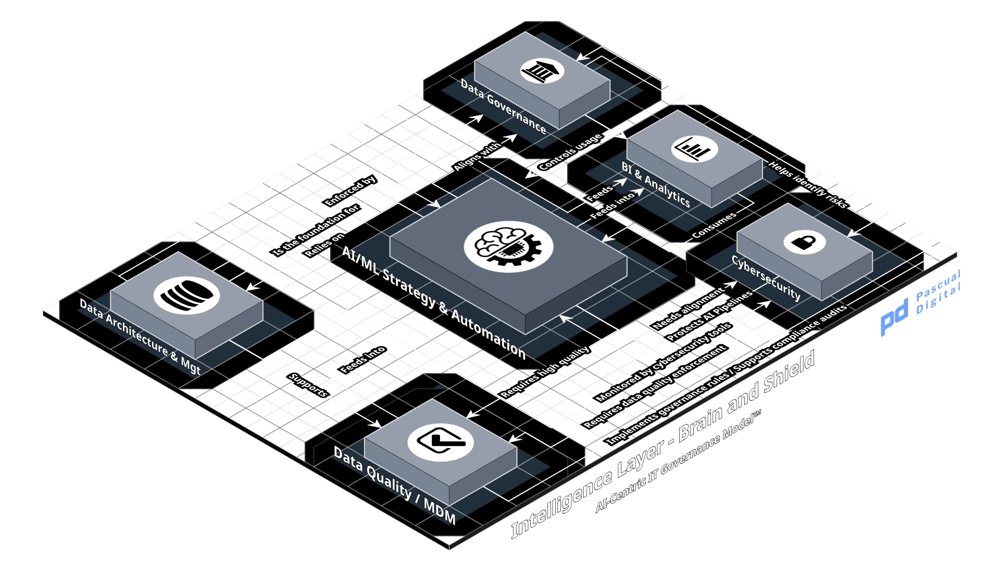

# Layer 3. Intelligence

Layer 3

The Brain & Shield

Can it be trusted?

## Purpose

Build and operate the model, data and security controls that make AI outputs usable, and produce the evidence that those controls ran.

## Scope boundary

| Excluded | Owned by | Boundary |
| --- | --- | --- |
| Risk appetite and residual risk acceptance | L4 | Never delegated. See the boundary note below. |
| The mandatory control catalog | L4 | L4 states which controls are required. L3 selects how they are implemented. |
| Authorization of a model for production use | L4 | L3 produces validation evidence. L4 decides it is sufficient. |
| AI system consequence classification | L4 | L3 supplies technical inputs to the classification. |
| Regulatory applicability and lawfulness determination | L4 | L3 implements what the determination requires. |
| Data protection impact assessment sign-off | L4 | L3 supplies technical detail and implements the mitigations. |
| Audit and attestation | L4 | L3 produces evidence. L4 verifies it. |
| Retention periods and access policy | L4 | L3 executes retention and enforces access. L4 sets both. |
| Incident disclosure decisions | L4 | L3 contains, investigates and documents. L4 decides what is disclosed. |
| Interface contract authoring and versioning | L2 | L3 declares an interface fit. L2 produces it. |
| Infrastructure capacity and runtime operation | L1 | L3 states the workload requirement. L1 provisions and runs it. |
| Third-party model commercial admission | L2 technical, L4 contractual | L3 evaluates technical suitability and neither admits nor contracts. |

Layer 3 operates controls. It does not decide which controls are mandatory, it does not accept residual risk and it does not authorize production use. Every one of those is Layer 4.

This layer has the largest exclusion list in the framework, and the length is the point. Layer 3 holds most of the technical capability and almost none of the authority, by design.

This layer is also where the **separation of build and acceptance** convention in section 0.1 of the normative reference does most of its work. Read Layer 3 alone and nothing visibly prevents a Model Owner from validating their own model and releasing it. The convention is what closes that, and it is why the exclusion list above is normative rather than advisory.

**The boundary most often crossed in practice.** A Model Owner sets the acceptance thresholds, runs the validation against those thresholds and then authorizes the deployment. Three roles collapse into one, and the person who built the system decides the system is good enough.

This is the single most common governance failure in AI deployment, and it is not resolved by better validation. It is resolved by separating the roles. Section 5 allocates threshold-setting and validation to Layer 3, and authorization to Layer 4, with no path for a Model Owner to hold both.

## Inputs

| Item | From | Form |
| --- | --- | --- |
| Mandatory control catalog | 4 | Required controls by system consequence class |
| AI system classification and risk appetite | 4 | Classification record setting the evidence bar for this system |
| Retention periods, lawfulness and access policy | 4 | Determinations the layer executes against |
| Interface contracts and specifications | 2 | Versioned machine-readable surfaces the layer assesses and consumes |
| Source system data | 2 | Data reaching the layer through catalogued interfaces |
| Compute, accelerator and storage capacity | 1 | Provisioned environments against the published capacity model |
| Business acceptance criteria | 4 | What the model must achieve for the decision it influences |
| Threat intelligence and vulnerability disclosures | external | Feeds, advisories, disclosure notices |
| Model provider documentation and license terms | 4 | Contracted provenance and permitted-use terms |

## Outputs

| Item | To | Form |
| --- | --- | --- |
| Deployed and validated models | external | Registered model versions with model cards |
| Deployed and validated models | 4 | Registered model versions with model cards |
| Validation, bias and performance test evidence | 4 | Test reports tied to a specific model version |
| Drift and performance telemetry | 4 | Continuous monitoring records against stated thresholds |
| Drift and performance telemetry | 5 | Continuous monitoring records against stated thresholds |
| Data quality reports and lineage records | 4 | Per domain, with fitness declarations |
| Data quality reports and lineage records | 2 | Per domain, with fitness declarations |
| Interface fitness records | 2 | Per AI-consumed interface, with review dates |
| Interface fitness records | 4 | Per AI-consumed interface, with review dates |
| Security telemetry and monitoring evidence | 4 | Retained logs meeting the evidence requirements set at L4 |
| Vulnerability findings and remediation status | 4 | Register with severity, SLA and closure evidence |
| Incident containment and forensic records | 4 | Timeline, actions taken, technical findings |
| Access grant and review records | 4 | Grants with justification and review dates |
| Consent and retention execution logs | 4 | Evidence that L4 determinations were carried out |
| Workload capacity requirements | 1 | Training and inference profiles per model, with growth assumptions |
| Maturity assessment per layer | 6 | Current governance capability against target |

Nearly every output of this layer is consumed by Layer 4. That is the layer's defining characteristic and it is worth stating plainly.

**Layer 3 is an evidence factory.** Its technical work is real and substantial, but its governance function is the production of records that permit someone else to decide.

## Decision rights

| ID | Decision | Decides | Consulted | Executes | Evidence | Delegated band | Interpretation |
| --- | --- | --- | --- | --- | --- | --- | --- |
| L3-01 | Approve a model for release to validation | Model Owner | CAIO, Data Steward and General Counsel | ML Engineering | Model card, training data manifest, version tag. Value-chain status determination where a third-party base was modified |  | Declare a model version ready to be tested against its thresholds. Where the model derives from a third-party base, this decision triggers a mandatory value-chain consultation. |
| L3-02 | Set technical acceptance thresholds for a model | Model Owner | Business Owner and CAIO | ML Engineering | Threshold record with rationale, bound to the model version. Includes drift bounds, which define the delegated band at L3-10 and L3-11. |  | Decide what accuracy, fairness and drift figures count as good enough. **Set before validation runs, not after**, or the threshold is chosen to fit the result. |
| L3-03 | Declare a data domain fit for use in a production model | Data Steward | Chief Data Officer and Model Owner | Data Engineering | Data quality report, lineage record, classification |  | Judge whether the data is accurate, complete and lineage-traceable enough that a decision may rest on it. Fit for one purpose is not fit for all purposes. |
| L3-04 | Declare an interface fit for consumption by an autonomous or AI system | Data Steward | Head of Enterprise Architecture, Model Owner and CISO | Engineering | Interface fitness record covering schema completeness, documented error conditions, review date and the interface specification version it was declared against |  | Same decision as L2-05, exercised here. One record, not two. Layer 2 authors the contract; Layer 3 judges whether it can be relied on. |
| L3-05 | Define the master record for a data entity | Chief Data Officer | Data Steward and Head of Enterprise Architecture | Data Engineering | Master data definition with survivorship rules |  | Decide which source is authoritative for an entity and how conflicts resolve. Canonical for the enterprise is not automatically fit for a given model, which is why AI fitness requirements are a separate decision. |
| L3-06 | Approve access to a classified data set | Data Steward | CISO and DPO | IAM operations | Access grant record with justification and review date |  | Grant access with a stated justification and a review date. Grants past review accumulate silently and are the most common assurance finding. |
| L3-07 | Select the technical implementation of a required control | CISO | DPO and Head of Enterprise Architecture | Security Engineering | Control design record with test evidence |  | Choose how a mandatory control is built. Layer 4 decides the control is required; this decides what it looks like. |
| L3-08 | Prioritize remediation of a detected vulnerability | CISO | Platform Owner and Model Owner | Security Engineering | Vulnerability record, remediation SLA, closure evidence |  | Decide what gets fixed first against the SLA in the control catalog. Model endpoints and training pipelines are frequently outside the scope that produced the finding. |
| L3-09 | Execute containment during a security incident | CISO | Head of Operations | Security Operations | Incident log, containment actions, forensic record |  | Act to limit an incident in progress. Containment is a technical decision; what gets disclosed and to whom is not, and belongs at Layer 4. |
| L3-10 | Retrain a model on detected drift, within the delegated band | Model Owner | Business Owner | ML Engineering | Retraining record referencing the drift trigger | Delegated | Refresh a model where drift stays inside the thresholds recorded at authorization. Operational, and it stays with the Model Owner. |
| L3-11 | Retrain, restrict or escalate on drift, at or beyond the delegated band | Business Accountable Executive | Model Owner, Head of Risk and CAIO | ML Engineering | Escalation record and the resulting Layer 4 decision | Delegated | Where drift breaches a recorded threshold, the decision stops being maintenance and becomes a risk decision about whether the system should keep operating. |
| L3-12 | Approve reuse of a feature set or derived dataset across models | Chief Data Officer | Data Steward and Model Owner | Data Engineering | Reuse approval with lineage from the originating purpose |  | Decide that data built for one purpose may serve another. The original lawfulness basis travels with it, and this is the mechanism by which consent boundaries fail quietly. |

Twelve decisions, against nine at Layer 1 and ten at Layer 2. This confirms the projection that Layer 4 will be the largest, and it raises the granularity question recorded at Layer 1 as a real constraint rather than a formatting preference.

Three allocations carry the weight.

**The threshold record defines a delegated band.** Drift bounds are a required element of it, not an optional addition. Without them the band at L3-10 and L3-11 is undefined, every drift observation becomes an ad hoc judgment, and escalation depends on the Model Owner's discretion, which is what the band exists to remove. A published band with no bounds is inert in the same way as a threshold Layer 4 never published.

**Threshold-setting and authorization are separated by design.** The Model Owner sets what good looks like technically. Layer 4 decides whether the model may go to production against those thresholds. Collapsing them recreates the builder-accepts failure this layer exists to prevent.

**The drift split is a delegated band, per section 0.1 of the normative reference.** Within the band it is an operational decision held by the Model Owner. At or beyond it, the same decision becomes a risk decision and leaves the layer. Layer 4 publishes the threshold. Until it does, all drift response defaults to the higher authority.

**The mandatory consultation on third-party derivation is a trigger, not a formality.** Modifying a purchased model can change an organization's status under the EU AI Act value-chain provisions, and the determination belongs at Layer 4. Placing the trigger on a technical act that always occurs is what stops the determination from depending on someone remembering to request it.

**Feature reuse fires on an act nobody observes.** A feature set is consumed by a second model without any decision point being crossed. Detection is by reconciling feature store access against the model registry: any model reading a feature set it did not originate requires this approval. Where that reconciliation does not exist, detection is unresolved and the specification says so rather than assuming the trigger works.

**Feature reuse is a decision, not an efficiency.** A feature set built for one purpose and reused for another carries the first purpose's lawfulness basis into the second context. That is the mechanism by which consent boundaries fail quietly, and it needs a named decision-maker rather than a shared repository.

## Artifacts

| ID | Name | Owner | Review | Scope | Required from |
| --- | --- | --- | --- | --- | --- |
| L3-ART-01 | Model registry with version, owner, status and consequence class | Model Owner | Continuous, reconciled quarterly | organization | Level 2 |
| L3-ART-02 | Vulnerability register with severity, SLA and closure evidence | CISO | Continuous | organization | Level 2 |
| L3-ART-03 | Data classification register | Data Steward | On change | organization | Level 3 |
| L3-ART-04 | Access grant register with justification and review dates | Data Steward | Quarterly review | organization | Level 3 |
| L3-ART-05 | Consent and retention execution logs | Data Steward | Continuous | organization | Level 3 |
| L3-ART-06 | Model card per production version, stating purpose, training data, limitations and thresholds | Model Owner | On every version change | system | per production model |
| L3-ART-07 | Training data manifest and provenance record | Model Owner | Per training run | system | per production model |
| L3-ART-08 | Validation, bias and performance test reports | Model Owner | Per version, retained for the life of the version plus the L4 retention period | system | per production model |
| L3-ART-09 | Data quality reports and lineage records per domain | Data Steward | Per domain review cycle | system | per data domain feeding a production model |
| L3-ART-10 | Interface fitness records for AI-consumed surfaces, version-bound | Data Steward | Per stated review date | system | per AI-consumed interface |
| L3-ART-11 | Drift monitoring records against stated thresholds | Model Owner | Continuous | system | at or above materiality. Org, Level 4 for all models. |
| L3-ART-12 | Security incident forensic records | CISO | Per incident | system | per incident |

**Scoping.** Organization-level artifacts are required from the stated maturity level. System-level artifacts are required per AI system, model, interface or event according to the condition stated. Artifacts in bold are part of the Level 2 minimum. See the minimum viable set document for what this amounts to at small scale.

**The artifact most often stale rather than missing.** Model cards are usually written once, at launch, and describe a version that stopped running some time ago. An expired model card is worse than an absent one, because Layer 4 verifies against it and reaches a false conclusion. Binding the card to the version tag, so a new version cannot deploy without one, is the only durable fix.

## Metrics

| Name | Unit | Guidance |
| --- | --- | --- |
| Production models with a model card current to the running version | Percentage | Target 100. Anything else means Layer 4 is verifying against stale evidence. |
| Production models with active drift monitoring against stated thresholds | Percentage | An unmonitored production model is an ungoverned one |
| Data domains feeding production models with a current fitness declaration | Percentage | Includes interfaces, per the Layer 2 boundary |
| Mean time to remediate critical vulnerabilities | Days | Tracked against the SLA set in the control catalog |
| Access grants past their stated review date | Count | Accumulates silently and is the most common audit finding |

Five metrics, applying the count proposed at Layer 1. Candidates cut were model validation pass rate, which measures the tests rather than the governance, and security incident volume, which measures the environment rather than the layer.

## Crosswalk

| Instrument | Coverage | Reference |
| --- | --- | --- |
| ISO/IEC 27001:2022 | full | Annex A operational controls: A.5.15 through A.5.18 access control, A.8.2 privileged access, A.8.8 vulnerability management, A.8.16 monitoring, A.8.24 cryptography, A.5.24 through A.5.28 incident management |
| NIST AI RMF | partial | Full for MEASURE, partial for MAP and MANAGE. MEASURE 2 through 4 map directly to validation, bias testing and drift monitoring. GOVERN sits at Layer 4. |
| ISO/IEC 42001 | partial | Annex A controls on AI system lifecycle, data management and third-party components. The management system obligations sit at Layer 4. |
| ISO/IEC 23894 | partial | AI risk management guidance. Technical treatment sits here, risk decisions at Layer 4. |
| COBIT 2019 | partial | APO13 Managed Security, APO14 Managed Data, DSS05 Managed Security Services |
| EU AI Act | partial | Article 10 data and data governance, Article 12 record-keeping, Article 14 technical enablement of human oversight, Article 15 requirements for accuracy and cybersecurity |
| ITIL 4 | partial | Information security management, monitoring and event management |
| TOGAF 10 | partial | Data Architecture domain only |
| ISO/IEC 38500 | none | Principle level only |

**The gap this crosswalk exposes.** No instrument in the list draws the line between operating a control and requiring it. Each specifies controls and assumes an organization has allocated the two responsibilities somewhere. That allocation is AI9GM's own contribution and it is the reason this layer's exclusion list runs longer than any other.

A second gap, larger and unresolved. None of these instruments governs an autonomous system that takes action rather than producing output. The controls here assume a model that infers and a human that acts. Where the model acts, the validation evidence in section 6 describes only half the system. Recorded in the plan addendum.

## Maturity descriptors

| Level | Name | Descriptor |
| --- | --- | --- |
| 1 | Initial | Models are built by whoever needed one. No registry, so no complete list of what runs in production. Validation happens against criteria the builder chose and recorded informally. Data fitness is assumed from the fact that a pipeline exists. Security controls cover infrastructure and treat model endpoints as ordinary services. |
| 2 | Managed | A model registry exists and is mostly current. Model cards are written at launch. Validation is documented and the thresholds are the builder's. Some data domains have stewards. Drift is monitored on the models someone remembered to instrument. Access grants are recorded and rarely reviewed. |
| 3 | Defined | Every production model is registered, carries a model card bound to its running version and was validated against thresholds recorded before validation ran. Every data domain and interface feeding a production model carries a current fitness declaration. Access is granted with justification and reviewed on cycle. Thresholds for drift escalation are published, and crossing them routes the decision to Layer 4. Model Owners do not authorize their own deployments. |
| 4 | Quantitatively Managed | Card currency, drift coverage, fitness coverage and remediation time are measured and reported to Layer 4 on cycle. Deviation triggers a defined response rather than a discovery. Evidence completeness is measured before audit rather than during it. Feature reuse is tracked to its originating lawfulness basis. |
| 5 | Optimizing | Model cards, lineage and validation evidence are generated by the pipeline, so evidence completeness is a property of deployment. Fitness declarations expire automatically and block consumption until renewed. Drift detection triggers retraining within band and escalation beyond it without human initiation. Controls are automated to the point where Layer 4 verifies a stream rather than a submission. |

The distance between levels 2 and 3 is dominated by one change that is organizational rather than technical: removing deployment authorization from the Model Owner. Every other level 3 requirement is achievable by a competent team. That one requires someone else to hold the authority.

## Anti-patterns

### The builder who accepts

The Model Owner sets the acceptance thresholds, runs the validation and authorizes the deployment. Every step is performed competently and no independent party ever asked whether the thresholds were the right ones.

Detection: Detected by reading the deployment authorization for a production model and checking whether the signing name also appears on the validation report.

### Evidence that expired

Model cards, validation reports and data fitness declarations describe versions that stopped running months ago. Layer 4 verifies against them and reaches a confident wrong conclusion.

Detection: Detected by comparing the version tag on the running model against the version tag on its most recent card.

### The unmonitored production model

A model was validated at launch, deployed and never instrumented for drift. Performance is assumed stable because nothing has been reported, and nothing has been reported because nothing is watching.

Detection: Detected by listing production models and checking which have a monitoring record within the last reporting period.

### The shadow model

A model was built inside a business unit, runs against production data and never entered the registry. It has no owner in the framework's terms, no fitness declaration for its inputs and no authorization.

Detection: Detected by reconciling accelerator consumption and data access logs against the registry.

### Security controls without AI scope

The security operations function monitors infrastructure, endpoints and network competently. Model inference endpoints, prompt and context surfaces, and the training pipeline are not in scope, because they were classified as application internals.

Detection: Detected by asking which AI-specific attack surfaces appear in the monitoring scope document, and receiving either a short answer or a blank one.
